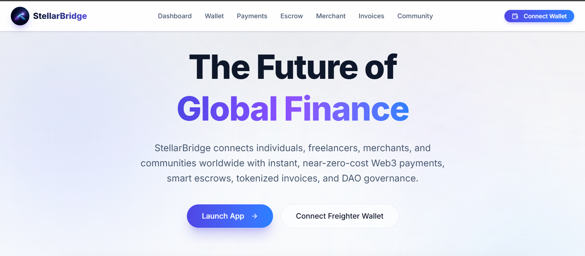
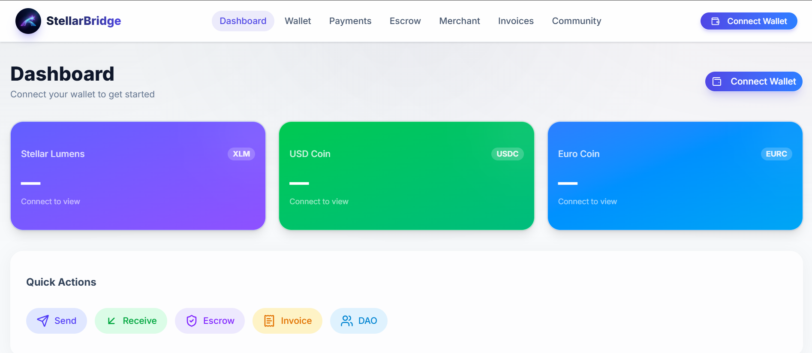
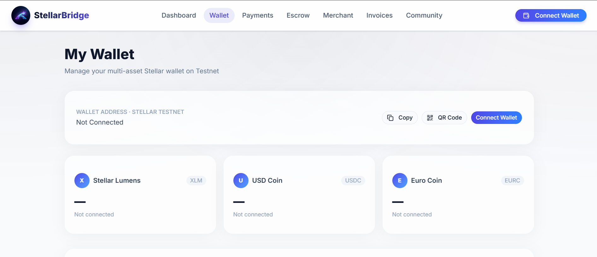
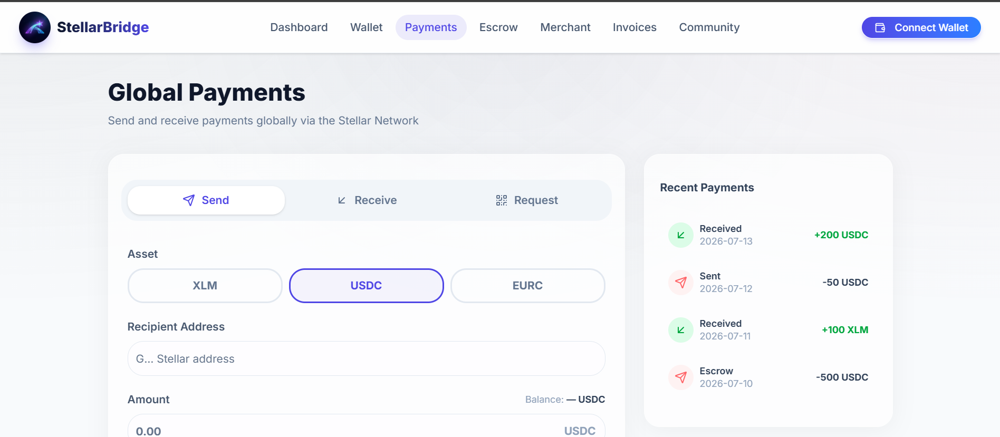
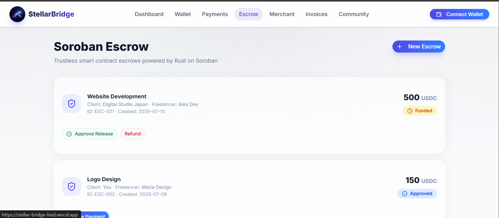
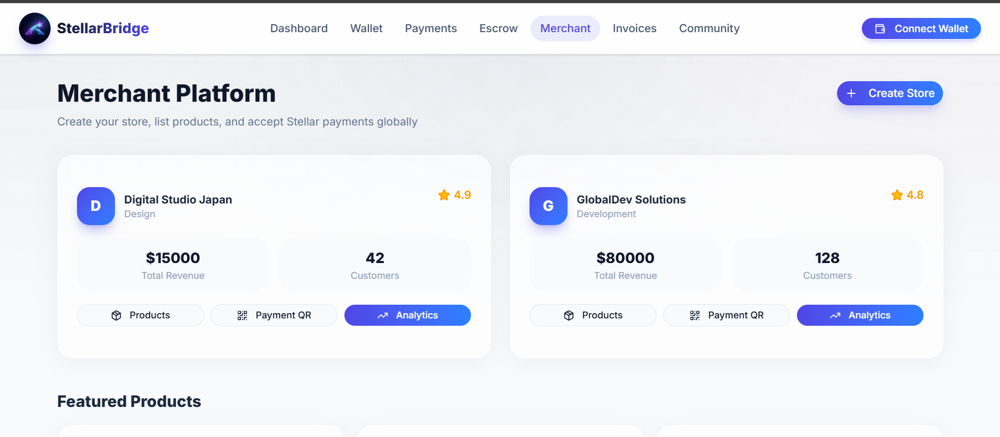
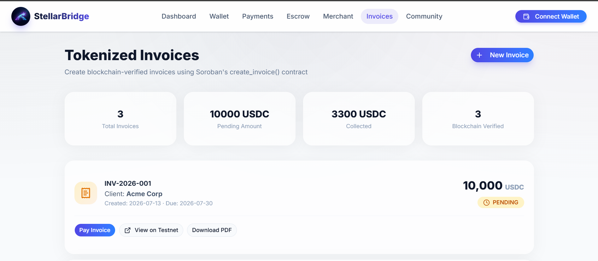
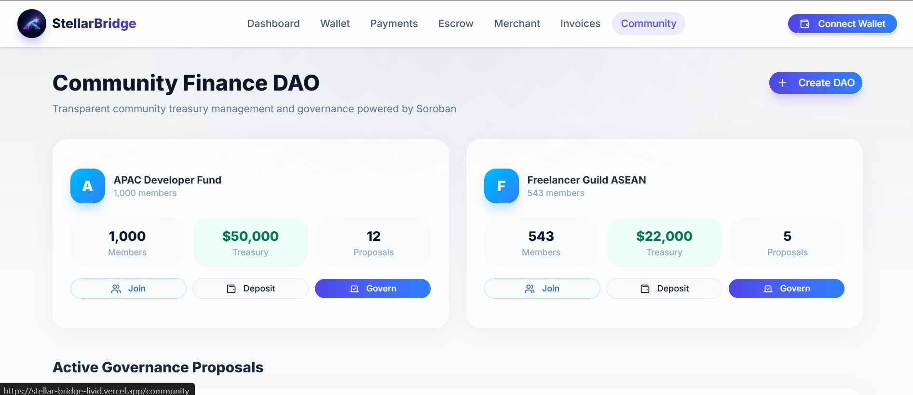
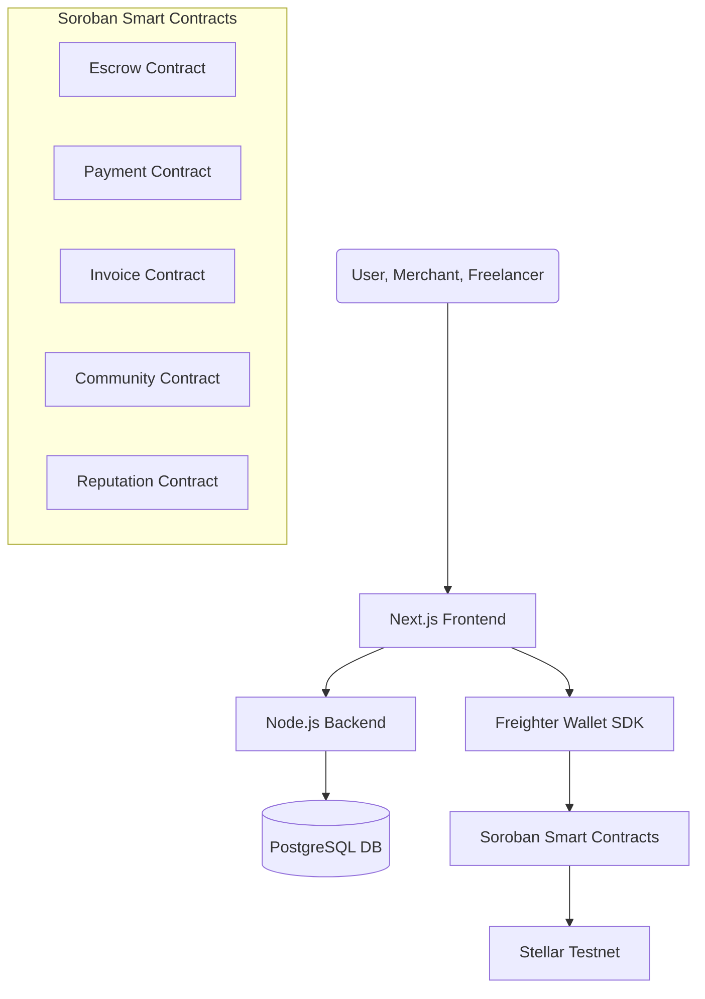

# StellarBridge 🌉
**A Global Decentralized Payment and Financial Access Network Powered by Stellar Soroban**

🚀 **Live Demo:** [https://stellar-bridge-livid.vercel.app/](https://stellar-bridge-livid.vercel.app/)

## 📸 Platform Previews

<!-- TODO: Ambil 4 screenshot aplikasi Anda, simpan di folder 'assets', dan beri nama screenshot1.png, screenshot2.png, dst. -->
| Landing Page | Dashboard |
|:---:|:---:|
|  |  |
| **Wallet** | **Payments & Transfers** |
|  |  |
| **Smart Escrow** | **Merchant Hub** |
|  |  |
| **Tokenized Invoices** | **Community (DAO)** |
|  |  |


## 1. Project Overview
StellarBridge is a comprehensive Web3 fintech platform designed to connect individual users, freelancers, merchants, small businesses, and global communities. It provides a suite of financial tools including cross-border payments, digital commerce, stablecoin transactions, smart contract escrows, tokenized invoices, and community finance DAOs.

## 2. Problem Statement
The current traditional financial system has significant pain points:
1. **High Fees:** International payments incur massive fees.
2. **Slow Settlements:** Cross-border transfers can take days to complete.
3. **Friction for Freelancers:** Global freelancers struggle to receive payments reliably.
4. **Merchant Barriers:** Businesses need borderless digital payment solutions.
5. **Lack of Transparency:** Communities require transparent and verifiable financial systems.

## 3. Solution
StellarBridge solves these problems by providing an all-in-one Web3 ecosystem:
- **Global Payment System:** Send and receive payments instantly with near-zero fees.
- **Soroban Escrow:** Trustless payments for freelancers and clients using smart contracts.
- **Merchant Platform:** Generate invoices, QR codes, and receive Stellar payments effortlessly.
- **Tokenized Invoices:** Turn invoices into verifiable digital assets on the blockchain.
- **Community DAO:** Transparent treasury management and voting for organizations.
- **Reputation System:** On-chain trust scoring based on successful transactions.
- **AI Financial Assistant:** Intelligent analytics for personal and merchant finances.

## 4. Why Stellar?
- **Speed & Cost:** Stellar's consensus protocol ensures transactions settle in seconds with a fraction of a cent in fees.
- **Local Finance & Real World Access:** Seamless integration with Stellar anchors allows users to move easily between fiat and digital assets (XLM, USDC, EURC).
- **Global Reach:** Stellar's infrastructure is purpose-built for global payments and asset issuance.

## 5. Why Soroban?
- **DeFi & Ecosystem Composability:** Soroban's Rust-based environment allows us to build secure, interoperable, and complex financial logic like escrows, DAOs, and tokenized invoices.
- **Developer Experience:** Soroban provides a robust, predictable, and scalable smart contract platform.

## 6. Architecture Diagram


## 7. Smart Contract Explanation
Our Rust-based Soroban contracts form the backbone of StellarBridge:
- **Payment Contract:** Handles core logic for processing testnet transactions securely.
- **Escrow Contract:** Manages trustless deposits and releases (`create_escrow`, `deposit_payment`, `approve_release`, `release_payment`, `refund_payment`).
- **Invoice Contract:** Tokenizes invoices (`create_invoice`, `pay_invoice`, `verify_invoice`).
- **Community Contract:** Facilitates DAO treasuries and voting (`create_fund`, `deposit`, `vote`, `withdraw`).
- **Reputation Contract:** Tracks and computes user trust scores based on on-chain history.

## 8. Future Roadmap
- **Phase 1 (Hackathon MVP):** Wallet integration, global payments, merchant tools, and Soroban escrow demo.
- **Phase 2:** Launch DAO community features, invoice tokenization, and on-chain reputation system.
- **Phase 3:** Integrate AI financial assistant and begin global expansion on Stellar Mainnet.

## 9. Business Model
- Minimal transaction fees for merchant processing (significantly lower than traditional gateways like PayPal).
- Premium features for enterprise merchants (advanced AI analytics, white-label invoicing).
- Ecosystem growth through DAO treasury management.

## 10. Social Impact
StellarBridge democratizes access to financial tools, allowing freelancers in developing nations to participate in the global economy, providing merchants with borderless commerce, and empowering communities with transparent treasury management.

## 11. Deployed Smart Contracts (Stellar Testnet)
**Important**: Below are the deployed Soroban contract addresses used in this project:

- **Escrow Contract:** `CCSHPTGDATNG4RIPNAJ4JD5F43KNN3ZLA3ENPIZDS7C2UVT4VJK5AIVG`
- **Payment Contract:** `CCNNUKX6IU4JFHP2NYHOAZ3Q7EJHPSUDJDZDZ5R3AP2SYCHIF7Z5C6XI`
- **Invoice Contract:** `CDMWL3Y7JMEZ2RZM2JD6MW5ZY2DHLARQT7YU5OAYPWZGDEFQXHSFKJH6`
- **Community/DAO Contract:** `CC5CE6IUUID5ZOACSNB6GB7D3TFHKZAWYEBQOUA47XOIH727RBYM5AWC`
- **Reputation Contract:** `CDV7YOMZD5MZ5UM6DSRT4LBXS3XBYSOCR7VIPL6G2EUW654YFJE4QZOA`

## 12. How to Run Locally

### Prerequisites
- [Node.js](https://nodejs.org/) (v18 or higher)
- [Rust](https://www.rust-lang.org/) & [Soroban CLI](https://soroban.stellar.org/docs/getting-started/setup) (for modifying smart contracts)
- [Freighter Wallet](https://www.freighter.app/) Browser Extension

### 1. Clone the Repository
```bash
git clone https://github.com/izath-phb/StellarBridge.git
cd StellarBridge
```

### 2. Frontend Setup (Next.js)
```bash
cd frontend
npm install
npm run dev
```
Open [http://localhost:3000](http://localhost:3000) with your browser to see the result.

### 3. Backend Setup (Node.js)
```bash
cd backend
npm install
npm run dev
```

### 4. Smart Contracts (Soroban)
If you want to compile the smart contracts manually:
```bash
cd contracts
stellar contract build
```
